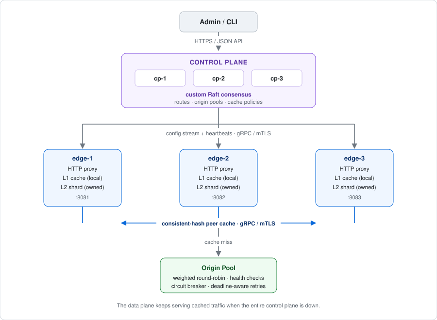
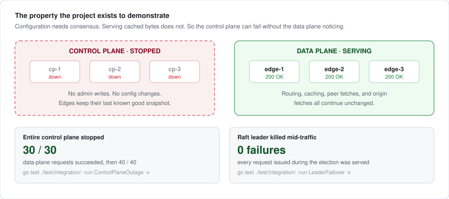

<div align="center">

# EdgeMesh

**A distributed edge proxy and cache in Go, with a custom Raft control plane,
consistent-hash peer caching, OpenTelemetry, Kubernetes, and reproducible
chaos testing.**

[](https://github.com/sheehanlloyd/edgemesh/actions/workflows/ci.yaml)
[](https://go.dev)
[](LICENSE)

*Production-inspired educational infrastructure. Not production-ready; see
[Limitations](#limitations).*

</div>

---

## What it is

EdgeMesh accepts HTTP traffic at multiple edge nodes, routes it to configured
origins, accelerates responses through a two-tier cache, distributes cache
ownership with a consistent hash ring, and coordinates configuration through a
three-node Raft control plane it implements itself.

The design question it answers is **which state deserves consensus**:

|  | Configuration | Cached content |
|---|---|---|
| Consistency | **Strong** (Raft) | **Eventual** |
| Cost of divergence | Traffic silently goes to the wrong place | One extra origin fetch |
| Cost of coordination | Paid once per admin write | Would be paid on every request |

Everything else follows from that split, including the property the project
exists to demonstrate: **the data plane keeps serving when the control plane is
entirely down.**

## Engineering highlights

- **Raft implemented from the paper**: leader election, log replication,
  durable state, snapshots, `InstallSnapshot`, and pre-vote, with all ten
  required failure scenarios tested against a partition-controllable in-memory
  transport. Three real bugs found in it, by running a cluster and by auditing
  what the tests actually assert, all documented rather than quietly fixed.
- **Consistent hash ring with measured behaviour**: 128 virtual nodes per
  edge. Growing 3 → 4 nodes remaps **25.9%** of 100,000 keys, against **75.1%**
  for modulo hashing.
- **Two-tier cache**: a local L1 for speed and a ring-distributed L2 for
  cluster-wide hit ratio. A cold object costs **one** origin fetch across the
  fleet, not one per node.
- **Coalescing that gets cancellation right**: not `singleflight`, because its
  fill inherits the first caller's context, so one impatient client fails
  everyone behind it. **30 concurrent cold requests → 1 origin fetch.**
- **Failure domains that hold**: with the entire control plane stopped,
  **30/30** data-plane requests succeeded. During a leader kill, **every request
  served through the election succeeded: 0 failures.**
- **Backpressure everywhere**: bounded in-flight requests, byte-budgeted
  caches, a droppable replication queue, LRU-capped rate-limiter keys, and
  deadline-aware retries.
- **Security in the design**: mTLS on all three internal protocols, SSRF
  guards re-checked at dial time to close the DNS-rebinding window, conservative
  cache-eligibility rules, and a production mode that refuses to start insecure.

## Architecture



Full detail in [docs/architecture.md](docs/architecture.md).

## Quick start

```bash
make build
make run-local     # 3 control nodes, 3 edges, 2 origins, no Docker needed
make demo          # scripted walkthrough; every step is asserted
make stop-local
```

With the full observability stack:

```bash
make compose-up    # adds Prometheus, Grafana, Jaeger, OTel Collector, Toxiproxy
make demo
```

Then: Grafana at `:3000`, Prometheus at `:9090`, traces at `:16686`.

### Watch the distributed cache work


```bash
# Four requests for one cold object across three edges. Watch where each is
# answered, then check what it cost the origin.
for port in 8081 8081 8082 8083; do
  curl -sD- -o /dev/null -H 'Host: demo.edgemesh.local' \
    http://127.0.0.1:$port/counter/demo | grep -i x-edgemesh-cache
done
curl -s http://127.0.0.1:9001/stats; curl -s http://127.0.0.1:9002/stats
```

```text
X-Edgemesh-Cache: MISS       # nothing had it; one origin fetch
X-Edgemesh-Cache: HIT        # same edge, straight out of its own L1
X-Edgemesh-Cache: HIT        # this edge is a replica for the key
X-Edgemesh-Cache: PEER_HIT   # this one is not, so it asked the owner
```

The last two lines depend on where the key lands on the ring: an edge that holds
a replica answers `HIT` from its own tier, one that does not answers `PEER_HIT`
after a single peer RPC. What does not vary is the number that matters. **The
origin is asked exactly once, no matter which edge is asked or how many.**

### Watch the failure domains stay separate



```bash
make chaos-leader &     # kill the Raft leader
for i in $(seq 1 50); do
  curl -so /dev/null -w '%{http_code} ' -H 'Host: demo.edgemesh.local' \
    http://127.0.0.1:8081/counter/demo
done
```

Every request returns `200` while the control plane elects a new leader.

## Measured results

These come from tests in this repository and are reproducible on any machine,
because they measure ratios and counts rather than machine-dependent rates.


| Property | Result | Reproduce |
|---|---|---|
| Key movement, 3 → 4 nodes | **25.9%** (vs 75.1% modulo) | `go test ./internal/ring/ -run KeyMovement -v` |
| Ring balance, 128 vnodes | ~16% worst-case deviation | `go test ./internal/ring/ -run Distribution -v` |
| Coalescing, 30 concurrent cold requests | **1** origin fetch | `go test ./test/integration/ -run Coalesced -v` |
| Data plane during a total control-plane outage | **30/30** succeeded | `go test ./test/integration/ -run ControlPlaneOutage -v` |
| Data plane during leader failover | **0 failures**, every request served | `go test ./test/integration/ -run LeaderFailover -v` |
| TinyLFU vs LRU, scan resistance | **93.5%** vs **0%** working set retained | `go test ./internal/cache/l1/ -run TinyLFU -v` |
| TinyLFU vs LRU, Zipf hit ratio | 0.816 vs 0.786 | `go test ./internal/cache/l1/ -run Zipf -v` |

**Throughput and latency numbers are deliberately not published here.** The
load-test tooling and the methodology are in
[docs/benchmarks.md](docs/benchmarks.md), ready to run. Results go in alongside
the hardware they were measured on, or they do not go in at all. A req/s figure
without its machine is advertising, not measurement.

## Implemented in EdgeMesh

**Written in this repository:**

- Raft consensus: election, replication, persistence, snapshots,
  `InstallSnapshot`, pre-vote
- The consistent hash ring, virtual nodes, and replica selection
- Both cache tiers: sharded storage, LRU accounting, TTL, admission policy, and
  a TinyLFU-inspired frequency filter
- HTTP cache-key construction and eligibility rules
- The route matcher with slash-boundary prefix semantics
- Request coalescing with independent waiter cancellation
- Circuit breaker and token-bucket rate limiter
- Control/data-plane orchestration, config streaming, and membership tracking

**Libraries used for commodity concerns:**

- gRPC and Protocol Buffers: transport and serialization
- bbolt: the durable storage primitive under the Raft log
- xxHash: the hash primitive under the ring
- OpenTelemetry SDK, Prometheus client, `log/slog`

## Testing

```bash
make test-race          # unit tests under the race detector
make test-integration   # in-process multi-node cluster: real gRPC, real Raft
make fuzz-smoke         # every fuzz target, discovered automatically, 10s each
make benchmark          # microbenchmarks
```

| Suite | Covers |
|---|---|
| Unit | Ring, routing, cache keys, admission policy, LRU accounting, rate limiter, breaker, Raft log, storage, state machine, config validation |
| Raft failure matrix | All ten required scenarios, plus invariants asserted over the whole observed history |
| Integration | Route propagation, cluster-wide cache fill, peer failure, coalescing, purge, origin health, rate limiting, control-plane outage, leader failover, ring convergence |
| Deployment | Helm output is fed through the real config loader; the chart must produce configuration the binaries accept |
| Fuzz | Nine targets: cache-key injectivity, `Cache-Control` parsing, response cacheability, request-ID generation, hop-by-hop header stripping, admin authentication, Raft command decoding, Raft snapshot restore, config loading |

Invariants are asserted, not just examples: at most one leader per term across
the entire run, committed prefixes never diverge, ring replicas never contain a
duplicate physical node.

## Deployment

| Target | Command | Notes |
|---|---|---|
| Local processes | `make run-local` | Fastest path; no Docker |
| Docker Compose | `make compose-up` | Full observability stack |
| kind | `make kind-up` | Real Kubernetes, locally |
| Helm | `helm install edgemesh deploy/helm/edgemesh` | Lints clean; validates its own values |
| AWS EKS | `deploy/terraform/aws` | **Human-invoked only** |

Local processes, Compose configuration, the Helm chart, and the Terraform are
all verified. Container images are built by CI on every push, and `make kind-up`
wants kind installed locally. See
[docs/demo.md](docs/demo.md#verification-status) for exactly what has been run.

The Helm chart refuses configurations that cannot work (an even Raft member
count, a non-power-of-two shard count, a replication factor above the edge count,
production mode without mTLS) at install time rather than at pod start.

**Nothing in this repository ever runs `terraform apply`.** CI runs `fmt`,
`init -backend=false`, and `validate` only. See
[ADR-008](docs/adr/008-no-automatic-terraform-apply.md) and the cost warning in
[deploy/terraform/aws/README.md](deploy/terraform/aws/README.md).

## Observability

- **Metrics**: Prometheus on every process, low-cardinality by design: no raw
  URLs, cache keys, request IDs, or client hostnames in labels.
- **Traces**: OpenTelemetry spanning ingress edge → peer cache → origin, so a
  cold request produces one trace across three processes.
- **Logs**: structured `slog` with consistent field names; credentials,
  cookies, and bodies are never logged.
- **Dashboards**: five provisioned Grafana dashboards: request overview, cache,
  origin and reliability, control plane and Raft, Go runtime.

## Documentation

| Document | Contents |
|---|---|
| [architecture.md](docs/architecture.md) | Design, request path, failure boundaries, backpressure |
| [raft.md](docs/raft.md) | The consensus implementation and its failure matrix |
| [cache.md](docs/cache.md) | Tiers, ring, keys, eligibility, invalidation |
| [failure-model.md](docs/failure-model.md) | Every failure scenario with reproduction steps |
| [threat-model.md](docs/threat-model.md) | Assets, boundaries, mitigations, accepted risks |
| [benchmarks.md](docs/benchmarks.md) | Measurement methodology and result templates |
| [api.md](docs/api.md) | Admin API reference |
| [demo.md](docs/demo.md) | Running the demo |
| [engineering-notes.md](docs/engineering-notes.md) | Seven problems worth writing down, and how each was found |
| [adr/](docs/adr/) | Ten architecture decision records |

## Limitations

Stated plainly, because a portfolio project that hides its edges is not useful:

- **Not production-ready.** No security audit, no production operation. The Raft
  implementation has nowhere near the hardening of `hashicorp/raft`.
- **Static control-plane membership.** No joint consensus; resizing needs a
  restart ([ADR-006](docs/adr/006-static-raft-membership.md)).
- **Rate limits are node-local.** With N edges, a configured rate R is an
  effective ceiling of up to N×R cluster-wide. Documented, not hidden.
- **No linearizable follower reads.** Admin reads go to the leader.
- **No TLS certificate rotation.** Certificates load at startup.
- **Whole objects only.** No `Range` support or partial caching in V1.
- **Not RFC-complete HTTP caching.** A conservative, well-tested subset.
- **Throughput numbers are not published.** The tooling and methodology are in
  place; a number is published with its hardware or not at all.

## Non-goals

No browser UI (Grafana is enough), no multi-tenancy or billing, no BGP/anycast/
DNS/WAF, no globally distributed production deployment, no custom TCP stack, and
no database written from scratch.

## License

[MIT](LICENSE)
