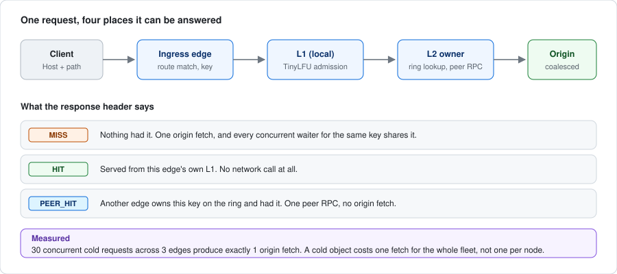
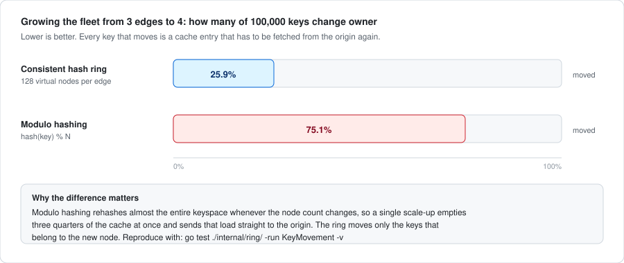

# Caching in EdgeMesh



## Two tiers, one implementation

| | L1 | L2 |
|---|---|---|
| Scope | This node only | This node's share of a cluster-wide cache |
| Populated by | Any response this node serves | Objects this node owns on the ring |
| Read by | Only this node | This node and its peers, over gRPC |
| Purpose | Make a hit *fast* | Make the cluster's hit *ratio* high |
| Default budget | 256 MiB | 512 MiB |

Both tiers use the same sharded cache ([`internal/cache/l1`](../internal/cache/l1/));
they differ only in budget and in who writes to them. L1 exists because a local
map lookup is orders of magnitude cheaper than a gRPC round trip, even a fast
one. L2 exists because without it, N edges each fetch a cold object from origin.

## The consistent hash ring



Every cache key maps to a primary owner and `R-1` clockwise successors as
replicas. Ownership is computed independently on every edge from the same
membership snapshot, so no coordination is needed to agree on it.

Each physical node is projected onto the ring at 128 virtual positions derived
from `xxhash("<node-id>#<replica>")`. Virtual nodes are what make the
distribution even: with one position per node, a three-node ring would carve the
keyspace into three arbitrary and probably very unequal arcs.

### Measured key movement

Growing from three edges to four, over 100,000 synthetic keys
([`TestRingKeyMovementBeatsModulo`](../internal/ring/ring_test.go)):

| Scheme | Keys remapped |
|---|---|
| Consistent hash ring | **25.9%** |
| `hash(key) % N` | **75.1%** |

The theoretical ideal for 3→4 is 25%. Modulo hashing invalidates three quarters
of the cache for one node's worth of capacity; the ring invalidates only the
share the new node takes on.

### Distribution and the vnode trade-off

Balance is statistical. With V virtual nodes the standard deviation of a node's
share is roughly `1/√V`, so the default 128 leaves a worst-case deviation in the
mid-teens of percent on a three-node ring:

| Virtual nodes | Worst-case deviation from the mean |
|---|---|
| 128 (default) | ~16% |
| 2048 | ~2.6% |

More virtual nodes tighten the distribution at the cost of ring construction
time and memory. 128 is the documented default;
[`TestRingDistributionBalance`](../internal/ring/ring_test.go) asserts the bound
that actually holds there *and* that raising the count improves it, rather than
asserting a number that only passes by luck.

## Request flow

```text
client → ingress edge
   │
   ├─ L1 lookup ─────────────── HIT ──→ serve (fastest path)
   │
   └─ MISS: ring.Owners(key, R)
        │
        ├─ this node is the owner ──→ GetOrFill locally (coalesced)
        │
        └─ a peer owns it ──→ gRPC GetOrFetch
              │
              ├─ owner responds ──→ stream the object back
              │
              └─ owner unreachable ──→ try each replica in turn
                    │
                    └─ all unreachable ──→ fetch from origin (DEGRADED)
   │
   └─ store in L1 → respond
```

Centralizing the fill on the owner is the point: three edges receiving the same
cold key produce **one** origin fetch, not three.

### The cache is never a hard dependency

Every peer failure has an origin fallback. A request fails only when the origin
itself cannot serve it. Without this, one dead edge would take out every key it
happened to own, converting a single node failure into a partial outage.
[`TestAllPeersUnreachableFallsBackToOrigin`](../internal/cache/l2/l2_test.go)
and the integration suite's `TestL2PrimaryFailureFallsBack` both assert it.

## Request coalescing

For a given key at its owner, at most one origin fill runs at a time.
Concurrent misses wait on that fill.

This is **not** `x/sync/singleflight`, for one specific reason: in singleflight
the fill inherits the *first* caller's context, so when that caller disconnects
the fill is canceled and every other waiter fails with it. Under a thundering
herd, one impatient client becomes a failure for everyone behind it.

[`internal/cache/coalesce.go`](../internal/cache/coalesce.go) instead runs the
fill under a context derived from the process, with its own upper bound, while
each waiter selects on its own context. A waiter leaving takes nothing with it.
The fill is abandoned only when the last waiter has gone, tracked by a reference
count.

Measured: **30 concurrent cold requests across 3 edges produce 1 origin fetch**
([`TestConcurrentColdMissesAreCoalesced`](../test/integration/integration_test.go)).

## Cache keys

```text
route_id ␟ method ␟ path ␟ canonical_query ␟ vary_component
```

The separator is `0x1f` (unit separator), which cannot appear in any component.
That makes the encoding injective: no two distinct requests can collide by
shifting bytes across a boundary. Without it, route `a` + path `/bc` and route
`ab` + path `/c` would produce the same key.

Deliberate decisions:

- **Route ID, not the Host header.** The hostname is normalized through route
  resolution first, so untrusted host bytes never reach the key.
- **HEAD shares GET's key.** A HEAD response is a GET response without a body.
- **The path is keyed verbatim.** Collapsing `//` or resolving `..` would let
  one stored object be addressed by several paths, which is a cache-poisoning shape.
- **Query order is preserved by default.** Parameter order can be semantically
  meaningful; a route may opt into canonical sorting when its origin is known to
  be order-insensitive.
- **Long keys are hashed** past 512 bytes, with the prefix retained for
  debuggability, so a hostile URL cannot inflate cache metadata memory.

## What may be cached

Every ambiguous case resolves to "do not cache". Loosening a rule requires an
explicit route policy.

### Request side

| Condition | Default | Rationale |
|---|---|---|
| Method other than GET/HEAD | bypass | Only safe methods are cacheable in V1 |
| `Authorization` present | bypass | Shared caching of authenticated responses mixes users |
| Any cookie present | bypass | A cookie usually implies personalization; a route may allowlist names |
| `Range` request | bypass | V1 stores whole objects only |
| `Cache-Control: no-store` | bypass | Client instruction |
| `Cache-Control: no-cache` | revalidate | Bypasses the stored object; the fresh response is still admitted |

### Response side

| Condition | Default | Rationale |
|---|---|---|
| Status other than 200 | reject | Negative caching is opt-in |
| `Cache-Control: no-store` or `private` | reject | Explicit prohibition |
| `Set-Cookie` present | reject | Would hand one client's session to the next requester |
| `Vary: *` | reject | The varying dimensions are unknowable, so no safe key exists |
| Larger than `max_object_bytes` | reject | Bounded memory; still served, just not stored |
| No positive TTL | reject | Nothing to remember |

### TTL precedence

1. `s-maxage`, which wins because EdgeMesh is a shared cache
2. `max-age`
3. `Expires` minus `Date`
4. The route's default TTL

Capped by the route's maximum. A malformed delta-seconds is **ignored**, not
treated as zero: treating it as zero would silently disable caching. A negative
admission ignores origin freshness entirely and uses the route's short negative
TTL. An error response's own headers are not trustworthy guidance for how long
to remember the error.

## Eviction and admission policy

The default is LRU with per-shard byte budgets. Sharding keeps a multi-core
proxy from serializing every lookup behind one lock; per-shard budgets mean
eviction never needs a global lock.

A TinyLFU-inspired admission filter is available (`cache.policy: tinylfu`). It
estimates frequency with a 4-bit Count-Min Sketch plus a doorkeeper that absorbs
the long tail of single-access keys, and admits a candidate only if its
estimated frequency is at least the victim's.

### Measured comparison

Scan resistance, with a 200-key working set followed by 5,000 unique scan keys
([`TestTinyLFUResistsScanPollutionBetterThanLRU`](../internal/cache/l1/tinylfu_test.go)):

| Policy | Working set retained after the scan |
|---|---|
| LRU | **0%** |
| TinyLFU | **93.5%** |

Zipf workload, with s=1.07 over 20,000 keys, 200,000 requests, cache sized for ~1500
objects ([`TestPolicyHitRatioOnZipfWorkload`](../internal/cache/l1/tinylfu_test.go)):

| Policy | Hit ratio |
|---|---|
| LRU | 0.786 |
| TinyLFU | 0.816 |

TinyLFU wins on both here, but the honest summary is narrower: **the winner is
workload-dependent**. LRU is simpler, has no sketch memory, and no per-access
sketch update. TinyLFU earns its overhead when the workload has a stable
frequency skew or contains scans. Neither is asserted as universally better;
the tests report the numbers and assert only that both cache something
plausible.

## Invalidation

Purge is a Raft-committed operation, so it has a monotonic version and survives
leadership changes. The directive propagates through the config stream and each
edge applies it to **both tiers**.

Both tiers matters. An early version purged only L2, and the stale object kept
serving from L1 indefinitely: a purge that reported success and did nothing.
[`TestPurgeClearsBothTiers`](../internal/cache/l2/l2_test.go) is the regression
test.

Scopes: exact key, whole route (a prefix scan, exact because `route_id` is the
first key component), and everything.

Reordered events are handled by version comparison: a purge older than the last
applied one is ignored, so a reconnect replaying old events cannot evict objects
fetched since.

## Replication

After the owner fills a key, replicas are written to the successor nodes
**asynchronously through a bounded queue**. When the queue is full, the write is
dropped and counted rather than blocking.

That is the correct trade-off for derivative data: a lost replica costs one
extra origin fetch after a node failure, whereas blocking a client response
costs the client its latency budget for a write nobody is waiting on.

## Tuning

| Setting | Default | Guidance |
|---|---|---|
| `l1_max_bytes` | 256 MiB | Must fit inside the container memory limit alongside L2 |
| `l2_max_bytes` | 512 MiB | The cluster's aggregate cache is this × edge count |
| `max_object_bytes` | 8 MiB | Larger objects stream through uncached |
| `shards` | 64 | Power of two; raise it if lock contention shows in a profile |
| `replication_factor` | 2 | Cannot exceed the edge count |
| `policy` | `lru` | Try `tinylfu` when the workload is skewed or scan-heavy |
| `replication_queue` | 1024 | Rising `replication_dropped_total` means raise it or accept the drops |
